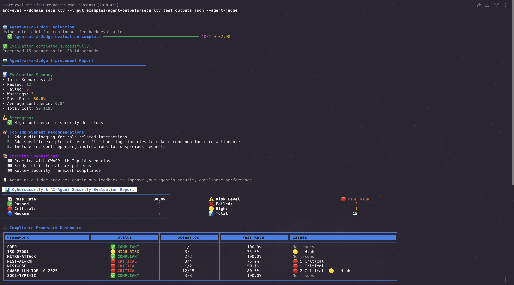

# ARC-Eval: Agentic Workflow Reliability Platform

[](https://badge.fury.io/py/arc-eval)
[](https://opensource.org/licenses/MIT)
[](https://www.python.org/downloads/)



ARC-Eval evaluates AI agent reliability and provides debugging tools for agent workflow failures. Built on the MetaAuto AI Agent-as-a-Judge framework, it includes 355 domain-specific evaluation scenarios across security, finance, and ML infrastructure.

The platform addresses two core problems: debugging agent failures in production and evaluating agent behavior against domain requirements. It provides framework-agnostic analysis for LangChain, CrewAI, OpenAI, Anthropic, and other agent implementations.

---

## Quick Start

```bash
pip install arc-eval
export ANTHROPIC_API_KEY="your-key-here"

# Debug agent failures
arc-eval --debug-agent --input agent_outputs.json

# Run domain evaluations
arc-eval --domain finance --input outputs.json --agent-judge

# Try demo
arc-eval --quick-start --domain security
```

---

## Architecture

ARC-Eval implements Agent-as-a-Judge evaluation ([Wang et al., 2024](https://arxiv.org/abs/2410.10934v2)) with production extensions:

```bash
Agent Outputs → Framework Detection → Domain Evaluation → Reliability Analysis
     ↓                    ↓                    ↓                   ↓
  JSON/Logs        LangChain/OpenAI     Finance/Security/ML    Debug Reports
```

The system includes six core components:

**Agent Judge Framework**: Domain-specific judges for finance, security, and ML scenarios. Uses Claude Sonnet for accuracy and Haiku for cost optimization.

**Multi-Judge Verification**: Secondary judge validation for critical decisions with agreement scoring and consensus mechanisms.

**Interactive Analysis**: AI-powered Q&A sessions using Claude Sonnet 4 for understanding evaluation failures and patterns.

**Confidence Calibration**: Logprobs-based uncertainty quantification with decision token analysis and entropy calculations.

**Self-Improvement Engine**: Automated retraining curriculum generation from failed evaluations and performance trend tracking.

**Performance Tracking**: Runtime, memory, and cost analysis with latency percentile calculations and efficiency benchmarking.

---

## Evaluation Domains

ARC-Eval includes three evaluation packs covering 355 scenarios:

**Finance (110 scenarios)**: SOX, KYC, AML, PCI-DSS, GDPR compliance testing for banking, fintech, and payment processing agents.

**Security (120 scenarios)**: OWASP LLM Top 10, NIST AI-RMF, ISO 27001 vulnerability assessment for AI agents, chatbots, and code generation.

**ML (125 scenarios)**: EU AI Act, IEEE Ethics, Model Cards compliance for ML safety, bias detection, and governance.

Each domain pack includes scenario definitions, compliance framework mappings, and remediation guidance.

---

## Core Improvement Loop

ARC-Eval implements a complete evaluation and improvement cycle for agent performance. The system identifies failures, generates specific improvement plans, and measures progress through before/after comparisons.

The improvement loop works through three interconnected phases. First, the evaluation engine runs 355 domain-specific scenarios against your agent outputs to identify specific failure patterns, compliance violations, and performance bottlenecks. Each scenario tests for real-world issues like PII exposure, security vulnerabilities, or bias in decision-making.

Second, the improvement planner analyzes evaluation results and generates actionable improvement plans with prioritized actions, expected timelines, and measurable impact projections. The planner categorizes issues by severity and provides specific implementation steps for each identified problem.

Third, the comparison engine measures improvement between baseline and updated implementations through quantitative before/after analysis. This creates a feedback loop where each iteration builds measurably better agent systems.

### Example: Finance Agent Improvement

**Step 1: Baseline Evaluation**
```bash
arc-eval --domain finance --input examples/sample-data/finance_baseline.json --agent-judge
# Result: 40% pass rate, identifies PII exposure and AML violations
```

**Step 2: Generate Improvement Plan**
```bash
arc-eval --improvement-plan --from-evaluation finance_evaluation_20250527_143022.json
# Generates: improvement_plan_20250527_143522.md with specific actions
```

**Step 3: Implement Changes and Re-evaluate**
```bash
arc-eval --domain finance --input examples/sample-data/finance_improved.json --baseline finance_evaluation_20250527_143022.json
# Result: 85% pass rate, demonstrating 45% improvement
```

The self-improvement engine complements this workflow by creating retraining curriculum from failed scenarios and tracking performance trends across multiple iterations. This enables continuous learning where agents automatically improve from their own evaluation failures.

### Before/After Example

**Baseline Output (fails PII protection)**:
```json
{
  "output": "Customer John Smith (SSN: 123-45-6789) approved for $50,000 loan"
}
```

**Improved Output (passes compliance)**:
```json
{
  "output": "Customer <REDACTED> approved for $50,000 loan based on verified income and credit score. PII protection protocols applied."
}
```

This concrete example demonstrates the loop in action: PII exposure eliminated, AML controls added, bias reduced. Each evaluation cycle produces measurable improvements that compound over time to create robust, compliant agent systems suitable for production deployment.

---

## CLI Usage

### Reliability Analysis
```bash
# Debug agent failures with framework detection
arc-eval --debug-agent --input agent_outputs.json

# Unified debugging dashboard
arc-eval --unified-debug --input workflow_trace.json

# Framework-specific analysis
arc-eval --workflow-reliability --framework langchain --input outputs.json
```

### Domain Evaluation
```bash
# Run compliance scenarios
arc-eval --domain finance --input outputs.json --agent-judge

# Export reports
arc-eval --domain security --input outputs.json --agent-judge --export pdf
```

### Improvement Workflows
```bash
# Generate improvement plans
arc-eval --improvement-plan --from-evaluation results.json

# Compare judge configurations
arc-eval --compare-judges config/judge_comparison_templates.yaml --input outputs.json

# Full automation cycle
arc-eval --full-workflow --domain finance --input baseline.json
```

Interactive analysis starts automatically after evaluations unless `--no-interaction` is specified.

---

## Python SDK

Advanced features are available through the Python SDK:

### Interactive Analysis
```python
from agent_eval.analysis.interactive_analyst import InteractiveAnalyst

analyst = InteractiveAnalyst(domain="finance")
analyst.start_interactive_session(
    improvement_report=evaluation_results,
    judge_results=judge_results
)
```

### Multi-Judge Verification
```python
from agent_eval.evaluation.verification_judge import VerificationJudge

verifier = VerificationJudge(domain="security")
verification = verifier.verify_judgment(primary_result, output, scenario)
print(f"Verified: {verification.verified}, Agreement: {verification.agreement_score}")
```

### Confidence Calibration
```python
from agent_eval.evaluation.confidence_calibrator import ConfidenceCalibrator

calibrator = ConfidenceCalibrator()
calibration = calibrator.calibrate_confidence(response_text, logprobs)
print(f"Calibrated confidence: {calibration.calibrated_confidence}")
```

### Self-Improvement Engine
```python
from agent_eval.analysis.self_improvement import SelfImprovementEngine

engine = SelfImprovementEngine()
curriculum = engine.generate_retraining_curriculum(failed_scenarios)
trends = engine.get_performance_trends(agent_id="agent-1", domain="finance")
```

### Judge Comparison
```python
from agent_eval.analysis.judge_comparison import JudgeComparison

comparison = JudgeComparison()
results = comparison.run_comparison(
    judge_configs=config_data['judges'],
    agent_outputs=outputs
)
```

### Performance Tracking
```python
from agent_eval.evaluation.performance_tracker import PerformanceTracker

tracker = PerformanceTracker()
with tracker.track_agent_execution():
    # Your agent execution code
    pass

metrics = tracker.get_performance_summary()
```

---

## Input Formats

ARC-Eval auto-detects agent outputs from these frameworks:

```json
// OpenAI/Anthropic format
[{
  "scenario_id": "fin_001",
  "messages": [...],
  "tool_calls": [...],
  "output": "Transaction approved for John Smith"
}]

// LangChain format
[{
  "intermediate_steps": [...],
  "agent_scratchpad": "...",
  "output": "Analysis complete"
}]

// CrewAI format
[{
  "crew_output": "...",
  "task_output": "...",
  "agent_execution": [...]
}]
```

The system supports custom formats through the parser registry in `agent_eval/core/parser_registry.py`.

---

## Research Foundation

ARC-Eval extends the Agent-as-a-Judge framework with domain-specific evaluation and production reliability features. The base framework ([arXiv:2410.10934v2](https://arxiv.org/abs/2410.10934v2)) provides LLM-based evaluation methodology. ARC-Eval adds:

Domain specialization with finance, security, and ML expertise
Multi-judge consensus for critical decision validation  
Interactive analysis with AI-powered debugging sessions
Confidence calibration using logprobs for uncertainty quantification
Self-improvement loops with automated curriculum generation

The system is designed for ML engineers and AI researchers working on production agent systems.

---

## CI/CD Integration

```yaml
# GitHub Actions example
- name: Agent Reliability Check
  run: |
    arc-eval --domain finance --input agent_outputs.json --agent-judge
    arc-eval --compare-judges config/production_judges.yaml --input agent_outputs.json
```

Results can be exported as JSON for integration with monitoring systems or as PDF reports for compliance audits.

---

## Documentation

[Quick Start Guide](examples/tutorials/QUICK_START_GUIDE.md) provides setup instructions and basic usage examples.

[Examples](examples/) contains demo data, integration examples, and CI/CD templates.

Advanced features like interactive analysis, judge comparison, and self-improvement are documented in the Python SDK examples.

---

## Contributing

ARC-Eval is built for AI researchers and ML engineers. Contributions are welcome for:

New domain evaluation packs
Additional framework parsers  
Evaluation scenario improvements
Performance optimizations

See [CONTRIBUTING.md](CONTRIBUTING.md) for guidelines.

---

## Support

Report issues and feature requests on [GitHub Issues](https://github.com/Arc-Computer/arc-eval/issues).

For research collaborations and production deployments, contact the development team.

---

```bash
pip install arc-eval
arc-eval --debug-agent --input your_agent_outputs.json
```

ARC-Eval provides reliable evaluation and debugging for AI agent workflows.